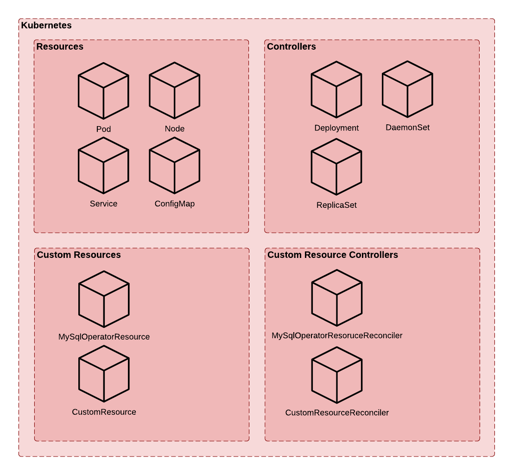
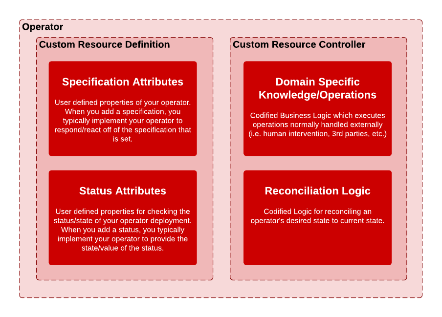
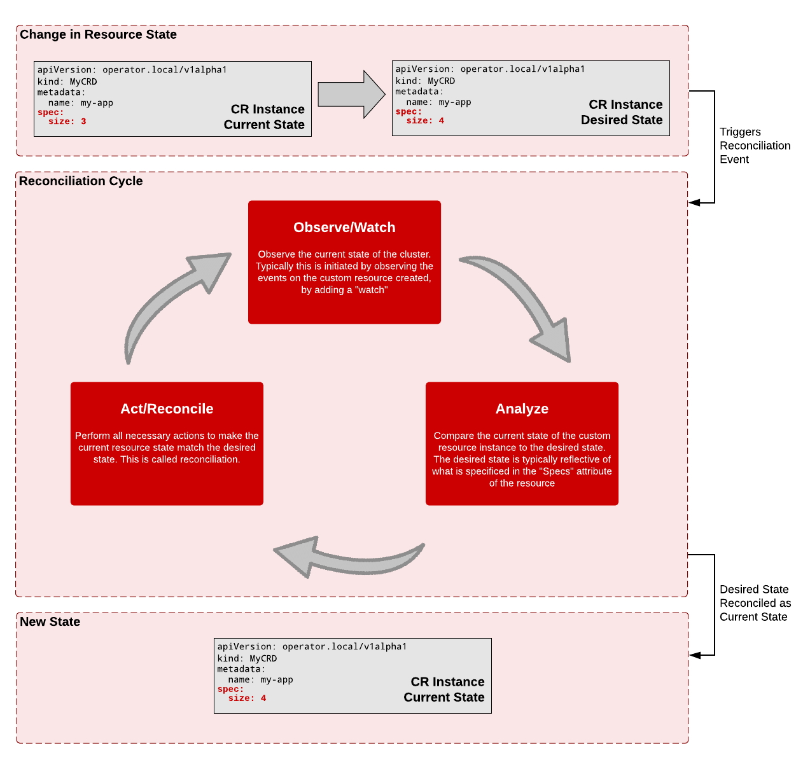

# Introduction

This guide serves all but one purpose: 

**To help assist people like you understand what Kubernetes Operators are and how to write them to do "stuff"**

## Prerequisites

You should have:

- Basic working knowledge of what containers and tools like, Docker, are.
- Basic working knowledge of creating and deploying resources in Kubernetes. 
- Basic working knowledge of the `kubectl` CLI utility
- Development experience across one or more projects (...as a coder). The more, the merrier.  

You will be best served from this material, if you come in with any of the following training (though not required): 

- CKAD/CKA certification or similar training
- Kubernetes courses (i.e. Coursera, Udemy, KodeKloud, etc. etc.)

## The Problem

To better understand the "What" and the "How" about Kubernetes Operators, we need to understand the problem(s) that motivated the need for Kubenertes Operators. 

Kubernetes is notorious in it's ability to integrate and facilitate declarative configuration and automation. This was out-of-the-box manageable for most stateless applications. 

However, for stateful applications this was a bit problematic. How do you manage and persist the state of your application and it's dependencies? How do you keep the rest of your application going when you add/remove dependencies? Of course, much of this management was done manually and/or required additional personnel resources to help manage (i.e. DevOps) and in general, required more of your attention.  

Much of these pains, boiled down to one ultimate question at hand: 

**How do you effectively automate Stateful Applications on Kubernetes?** 

That answer came in the form of what we call... 

```bash
░█████╗░██████╗░███████╗██████╗░░█████╗░████████╗░█████╗░██████╗░░██████╗
██╔══██╗██╔══██╗██╔════╝██╔══██╗██╔══██╗╚══██╔══╝██╔══██╗██╔══██╗██╔════╝
██║░░██║██████╔╝█████╗░░██████╔╝███████║░░░██║░░░██║░░██║██████╔╝╚█████╗░
██║░░██║██╔═══╝░██╔══╝░░██╔══██╗██╔══██║░░░██║░░░██║░░██║██╔══██╗░╚═══██╗
╚█████╔╝██║░░░░░███████╗██║░░██║██║░░██║░░░██║░░░╚█████╔╝██║░░██║██████╔╝
░╚════╝░╚═╝░░░░░╚══════╝╚═╝░░╚═╝╚═╝░░╚═╝░░░╚═╝░░░░╚════╝░╚═╝░░╚═╝╚═════╝░
```

## What's an Operator?

"An operator is a Kubernetes controller that understands 2 domains: Kubernetes and something else. By combining knowledge of both domains, it can automate tasks that usually require a human operator that understands both domains."
-Jimmy Zelinskie - https://bit.ly/3iS6AFx

An operator allows you to encapsulate kubernetes application resources (i.e. pods, deployments, daemonsets, statefulsets, jobs, services, configmaps, etc), by creating a [CRD (Custom Resource Definition)](https://kubernetes.io/docs/concepts/extend-kubernetes/api-extension/custom-resources/) and a Kubernetes [Controller](https://kubernetes.io/docs/concepts/architecture/controller/). It manages the state of your application resources and drives deployment and domain specific operations (operational knowledge) of your CRD deployment instance(s).

Operator = Resource + Controller + Domain Specific Operations

### Kubernetes: Resources + Controllers



In Kubernetes, for simplicity's sake, the basic building blocks that we use to orchestrate our containers can be categorized into either "resources" and "controllers"

Resources can be composed of things like Nodes, Pods, ConfigMaps, and Services to name a few. Controllers can be composed of things like Deployments, ReplicaSets, and DaemonSetsIf you've worked with Kubernetes, then you may already be familiar with some of the constructs that we're looking at. 

You are not Limited to the readily available resources and controller types offered by Kubernetes. That’s because Kubernetes is a platform. It was made to be expanded upon. And when you treat it like a platform, you can do some pretty amazing things. 

You can create your own Resources and Controllers to communicate and extend the Kubernetes orchestration platform. It's supported by rich APIs and libraries written in Golang. Consequently, you can leverage those same libraries and APIs to aid you in the creation of your own Custom Resources and Controllers. 

By being able to leverage existing resources and creating your own resources and controllers, you can orchestrate and automate your workloads in anyway possible that you can imagine. It's not a static platform. And so therefore, you're not boxed into a default set of resources and controllers. 

### Domain Specific Knowledge/Operations

Domain or Application specific knowledge is another crucial piece w/in the Operator Pattern. It is generally part of your business logic. This knowledge ties in heavily to a Custom Resource Controller. The reason for this, is because all of the operational knowledge that you want to codify and automate, gets put into the controller! The Custom Resource itself, merely provides useful information that the Resource controller can leverage, in the form of custom resource specification and status attributes. 

Examples of Domain Specific Tasks and Operations may include, but not limited too
- Configuration requirements
- Installation requirements
- Logging/Security requirements
- HA/Scaling requirements
- Application start-up and shutdown routines
- Process and workflow triggers
- Application Deployment
- Etc. 

This isn’t an exhaustive list, by any means,  The possibilities, however, of what you can accomplish are quite limitless.

Regardless of what the operation is, what business requirements or needs you must fullfill, all of these things must be coded w/in a Customer Resource controller. 


### Conventional versus Operator based Deployments

The advantages of an operator can be seen when you start thinking about how you manage your applications deployed into a Kubernetes cluster. Typically, you manage the deployment of each individual resource which usually composes the entirety of the application you deploy.

With operators, these resources are packaged up, and generally expose domain specific attributes (i.e. specifications ) for your deployment from a single point of configuration -- your "Operator" instance. 


In the illustration above, the real work to allocate and configure the service, deployment, and configmap, does not dissappear, when building an operator. They are managed by your custom resource's controller. You must specify the resource artifacts and the details of those artifacts you want w/in your operator's CRD instance. You are responsible for the resources you want in your operator.

You see the immediate benefits of an operator, when you begin configuring and deploying instances of your operator instead of deployments for various resources of a convential deployment. Notice, how much simpler and less error proned the operator configuration is in comparison to a conventional deployment. 

An operator based deployment in this regards, buys consistency, by offering you a way to templatize your conventional deployment as well as allow you to develop domain specific operations ( or operational knowledge) into your operator via a controller implementation. Essentially, you create what the community calls a Kubernetes Application. 

## How do Operators Work? 



From a high level, an operator is composed of the following components: 

  - A Custom Resource
  - A Resource Controller

A Custom Resource (CRD) **allows you to extend the Kubernetes API**

The relationship between the two: **A Custom Resource (CRD) needs a Controller to act upon it's presence (i.e. CRD instance)**

Without a controller for your custom resource, then it’s just a stateless object w/in Kubernetes. 

So then, How does a controller work? What does it do? What’s inside of a controller? 



In a nutshell, the Resource Controller ensures that the current state of a resource matches the desired state of a resource. 

An example of this is if we specified the number of pods of a resource through an arbitrary specification/attribute, `size`, on the custom resource instance. If we increase/decrease the value, then we are setting the desired state. 

The following idempotent cycle takes place when a resource change event occurs. 

* **Observe/Watch**: In this phase, the controller observes the state of th cluster. Typically this is initiated by observing the events on the custom resource instance. These events are usually subscribed from the custom resource controller. Consider this to be similar in ways to a pub/sub mechanism between the resource controller and cluster. 

* **Analyze**: In this phase, the resource controller compares the current state of the resource instance to the desired state. The desired state is typically reflective of what is specified in the `spec` attributes of the resource. 

* **Act/Reconcile**: In this phase, the resource controller performs all necessary actions to make the current resource state match the desired state. This is called reconciliation, and is typically where operational knowledge is implemented (i.e. business/domain logic).

The reconciliation cycle generally runs until the desired state is achieved or until an error is thrown. It is not uncommon to see the reconciliation cycle run repeatedly as it treats each run as an itempotent process. 

## Types of Operators

With regards to the Operator Framework, the following Operator Types are supported: 

- Golang Operators
- Helm Operators
- Ansible Operators

But wait, there's more! Outside of the Operator Framework: 

- Java Operators
- Python Operators
- Javascript/Typescript Operators
- JSONNET Operators

[Return to Table of Contents](../../../../)