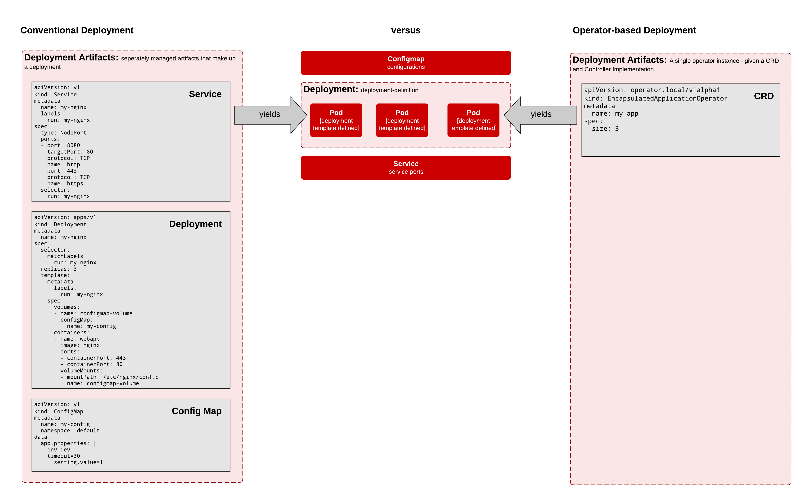

<!--
- Introduction
  - How to Learn to Write Operators Using this Resource
  - What's an Operator?
  - Types of Operators
  - Operator Tooling & Resources  

  address feedback: 
  
  - [x] work on the description of "what is an operator". Maybe more of the what and why and less of the how. Your description assumes a lot of what someone knows already.

  - [x] start by defining the problem that operators solve.  It's a good way to set the context and makes the definitions easier to fully understand.  Typically the technology is easy to follow, but the "why" is lacking.  

-->

# Introduction

This guide serves all but one purpose: 

**To help assist people like you understand what Kubernetes Operators are and how to write them**

## The Problem

To better understand the "What" and the "How" about Kubernetes Operators, we need to understand the problem(s) that motivated the need for Kubenertes Operators. 

Kubernetes is notorious in it's ability to integrate and facilitate declarative configuration and automation. This was out-of-the-box manageable for most stateless applications. 

However, for stateful applications this was a bit problematic. How do you manage and persist the state of your application and it's dependencies? How do you keep the rest of your application going when you add/remove dependencies? Of course, much of this management was done manually and/or required additional personnel resources to help manage (i.e. DevOps) and in general, required more of your attention.  

Much of these pains, boiled down to one ultimate question at hand: 

**How do you effectively automate Stateful Applications on Kubernetes?** 

That answer came in the form of what we call an Operator. 

## What's an Operator?

An operator is a software extension to Kubernetes. It's a design pattern which allows you to: 

- automate the creation and updating of resources and constructs
- automate the execution of processes
- automate the execution of domain specific operations
- automate the triggering and execution of rules
- utlimately extend the capabilities and features of Kubernetes

An operator allows you to encapsulate kubernetes application resources (i.e. pods, deployments, daemonsets, statefulsets, jobs, services, configmaps, etc), by creating a [CRD/Custom Resource Definition](https://kubernetes.io/docs/concepts/extend-kubernetes/api-extension/custom-resources/) and a custom [Controller](https://kubernetes.io/docs/concepts/architecture/controller/) implementation which manages the state of your application resources and drives deployment and/or business logic (operational knowledge) of your CRD deployment instance(s).

The advantages of an operator can be seen when you start thinking about how you manage your applications deployed into a Kubernetes cluster. Typically, you manage the deployment of each individual resource which usually composes the entirety of the application you deploy.

With operators, these resources are packaged up, and generally expose domain specific attributes (i.e. specifications ) for your deployment from a single point of configuration -- your "Operator" instance. 

In the illustration above, the real work to allocate and configure the service, deployment, and configmap, does not dissappear, when building an operator. They are managed by your custom resource's controller. You must specify the resource artifacts and the details of those artifacts you want w/in your operator's CRD instance. You are responsible for the resources you want in your operator.

You see the immediate benefits of an operator, when you begin configuring and deploying instances of your operator instead of deployments for various resources of a convential deployment. Notice, how much simpler and less error proned the operator configuration is in comparison to a conventional deployment. 

An operator based deployment in this regards, buys consistency, by offering you a way to templatize your conventional deployment as well as allow you to develop business logic ( or operational knowledge) into your operator via a controller implementation. Essentially, you create what the community calls a Kubernetes Application. 

## How do Operators Work? 

From a high level, an operator is composed of the following components: 

  - A Custom Resource
  - A Resource Controller

A Custom Resource (CRD) **allows you to extend the Kubernetes API**

The relationship between the two: **A Custom Resource (CRD) needs a Controller to act upon it's presence (i.e. CRD instance)**

Otherwise, without a controller, the Custom Resource does nothing for you.

How does the controller work? What does it do? 

In a nutshell, the Resource Controller ensures that the current state of a resource matches the desired state of a resource. 

An example of this is if we specified the number of pods of a resource through an arbitrary specification/attribute, `size`, on the custom resource instance. If we increase/decrease the value, then we are setting the desired state. 

The following idempotent cycle takes place when a resource change event occurs. 

* **Observe/Watch**: In this phase, the controller observes the state of th cluster. Typically this is initiated by observing the events on the custom resource instance. These events are usually subscribed from the custom resource controller. Consider this to be similar in ways to a pub/sub mechanism between the resource controller and cluster. 

* **Analyze**: In this phase, the resource controller compares the current state of the resource instance to the desired state. The desired state is typically reflective of what is specified in the `spec` attributes of the resource. 

* **Act/Reconcile**: In this phase, the resource controller performs all necessary actions to make the current resource state match the desired state. This is called reconciliation, and is typically where operational knowledge is implemented (i.e. business/domain logic).

The reconciliation cycle generally runs until the desired state is achieved or until an error is thrown. It is not uncommon to see the reconciliation cycle run repeatedly as it treats each run as an itempotent process. 

## Types of Operators

With regards to the Operator Framework, the following Operator Types are supported: 

- Golang Operators
- Helm Operators
- Ansible Operators

But wait, there's more! Outside of the Operator Framework: 

- Java Operators
- Python Operators
- Javascript/Typescript Operators
- JSONNET Operators

