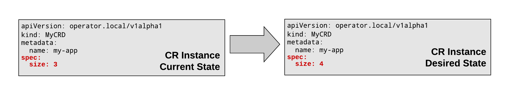

# Golang Operators

## Prerequisites

- Review the [introduction](../01/01-introduction.md), if you have not already
- Familiarity with Golang. If you are not familiar with Go, atleast go through this resource: https://tour.golang.org/welcome/1

## Agenda

This section will cover the following: 

- Review options for working with Operators in Golang
- Useful Golang API References for working with CRDs, Controllers, and the [Controller Runtime](https://github.com/kubernetes-sigs/controller-runtime)
- Review the [Reconciliation Cycle](../01/01-introduction.md#how-do-operators-work) with Golang semantics

Afterwards, you will take the plunge in a guided walkthrough. 

# Golang Operator Resources

## Development Libraries

Two resources you can check out for writing Operators in Golang: 

- [Operator Framework](https://operatorframework.io/)
- [Kubebuilder](https://book.kubebuilder.io/quick-start.html)

> In this section, as we discuss Golang Operators, we will be referring to the __Operator Framework__, as we continue to discuss. 

In case you are curious of some of the differences between the two, here's a recap: [What is the difference between kubebuilder and operator-sdk?](https://github.com/operator-framework/operator-sdk/issues/1758#issuecomment-517432349)

## Useful Golang API References

>NOTE: By no means, I'm not expecting you to memorize or review in detail what the APIs below are and do. I expect you to just be aware of the location of these API docs, as they may come in handy as you build out your own operator(s) and would like to understand better what these APIs are, as the Golang Operator libaries/frameworks make heavy use of them, without a ton of explanation, rhyme, or reason of what they are and what they do. 

The APIs below are commonly leveraged by Kubernetes. Subsequently, they are also commonly leveraged by Golang Operator development libraries. You will make usage of these libaries, as well as others, when scaffolding your Operators for development. Many of the API reference docs come with inline examples of how to use them in code. This is just a small subset of what's actually available out here in the community. 

- Controller Runtime
    - https://pkg.go.dev/github.com/kubernetes-sigs/controller-runtime?tab=doc
        - The Kubernetes controller-runtime Project is a set of go libraries for building Controllers. It is leveraged by Kubebuilder and Operator SDK. Both are a great place to start for new projects. See Kubebuilder's Quick Start to see how it can be used. 
        - Package controllerruntime alias' common functions and types to improve discoverability and reduce the number of imports for simple Controllers.
        - see: https://github.com/kubernetes-sigs/controller-runtime

    - https://pkg.go.dev/sigs.k8s.io/controller-runtime?tab=doc
        - Package controllerruntime provides tools to construct Kubernetes-style controllers that manipulate both Kubernetes CRDs and aggregated/built-in Kubernetes APIs. It defines easy helpers for the common use cases when building CRDs, built on top of customizable layers of abstraction. Common cases should be easy, and uncommon cases should be possible. In general, controller-runtime tries to guide users towards Kubernetes controller best-practices.
  
- https://pkg.go.dev/k8s.io/apimachinery?tab=overview
  - Scheme, typing, encoding, decoding, and conversion packages for Kubernetes and Kubernetes-like API objects.

- https://pkg.go.dev/k8s.io/api?tab=overview
  - Schema of the external API types that are served by the Kubernetes API server.
  - Most notably, you will be able to find the types for constructing resources such as (to name a few):
    - Pods
    - Services
    - Deployments
    - Replicasets
    - Daemonsets

- https://pkg.go.dev/k8s.io/client-go?tab=overview
  - Go clients for talking to a kubernetes cluster.
  - see also: https://github.com/kubernetes/client-go

# The Reconciliation Cycle - Revisited

> In the introduction, we presented the reconciliation cycle in a resource controller as followed: 


> In this section, we will recap the Reconciliation Cycle in more detail with Golang Operator specific embellishments to the Reconciliation Cycle, as shown below:  


Each stage in the Reconciliation Cycle, correspond to particular points of interest in a Resource Controller. In the context of the Operator Framework, A resource controller has the following general templated structure. 

> FYI, don't try to memorize this template. Do understand that their are entry points for where you will implement the logic corresponding to specific stages in the reconciliation cycles. Those entry points are noted in the code comments below (i.e. OBSERVE/WATCH and ACT/RECONCILE stage)

```golang
package mycrd

import (
	mycrdv1alpha1 "github.com/keunlee/task-001-operator/pkg/apis/mycrd/v1alpha1"
	"k8s.io/apimachinery/pkg/runtime"
	"sigs.k8s.io/controller-runtime/pkg/client"
	"sigs.k8s.io/controller-runtime/pkg/controller"
	"sigs.k8s.io/controller-runtime/pkg/handler"
	logf "sigs.k8s.io/controller-runtime/pkg/log"
	"sigs.k8s.io/controller-runtime/pkg/manager"
	"sigs.k8s.io/controller-runtime/pkg/reconcile"
	"sigs.k8s.io/controller-runtime/pkg/source"
)

var log = logf.Log.WithName("controller_mycrd")

var _ reconcile.Reconciler = &MyCRD{}

type ReconcileTask001 struct {
	client client.Client
	scheme *runtime.Scheme
}

func Add(mgr manager.Manager) error {
	return add(mgr, newReconciler(mgr))
}

func newReconciler(mgr manager.Manager) reconcile.Reconciler {
	return &MyCRD{client: mgr.GetClient(), scheme: mgr.GetScheme()}
}

// --------------------
// OBSERVE/WATCH STAGE: Observe the current state of the cluster. Add a watch to observe
// artifacts w/in the customer resource
// --------------------
func add(mgr manager.Manager, r reconcile.Reconciler) error {
	c, err := controller.New("mycrd-controller", mgr, controller.Options{Reconciler: r})
	if err != nil {
		return err
	}

	err = c.Watch(&source.Kind{Type: &mycrdv1alpha1.MyCRD{}}, &handler.EnqueueRequestForObject{})
	if err != nil {
		return err
	}

  // TODO: Watch for changes to secondary resources
  // 
  // ADD WATCHES HERE
  //

	return nil
}

// --------------------
// ACT/RECONCILE STAGE : Perform all necessary actions to the make current resource state match
// the desired state. This is called reconciliation.
// --------------------
func (r *ReconcileMyCRD) Reconcile(request reconcile.Request) (reconcile.Result, error) {

  // TODO: Implement reconciliation controller logic
  // 
  // ADD RECONCILIATION LOGIC HERE
  //

	return reconcile.Result{}, nil
}
```

> **The template above can be a "code generated" artifact**, when using the Operator Framework. Once you've generated your resource controller template, it is then your responsiblity to fill in the rest of the template so that it functions and operates as you want. We will examine in more detail this feature when executing the labs portion of this guide. 

## Observe/Watch

In this phase, the controller observes the state of the cluster. Typically this is initiated by observing the events on the custom resource instance. These events are usually subscribed from the custom resource controller. Consider this to be similar in ways to a pub/sub mechanism between the resource controller and cluster. 

The execution of this stage occurs when we've either created or updated a custom resource. Behind the scenes, the create/update operations are essentially the same operation since all kubernetes resources are idempotent. 

A simplified example definition of a resource might look like the following: 

```yaml
apiVersion: operator.local/v1alpha1
kind: MyCRD
metadata: 
  name: my-app
spec:
  size: 3
```

When this resource is created, part of the resource creation process involves adding "watches" on the resource. A "watch" is essentially an observer, which observes the current state of the resource. They can be added in code w/in the resource controller (see code below and/or templated code above): 

```golang
// --------------------
// OBSERVE/WATCH STAGE: Observe the current state of the cluster. Add a watch to observe
// artifacts w/in the customer resource
// --------------------
func add(mgr manager.Manager, r reconcile.Reconciler) error {
	c, err := controller.New("mycrd-controller", mgr, controller.Options{Reconciler: r})
	if err != nil {
		return err
	}

	err = c.Watch(&source.Kind{Type: &mycrdv1alpha1.MyCRD{}}, &handler.EnqueueRequestForObject{})
	if err != nil {
		return err
	}

  // TODO: Watch for changes to secondary resources
  // 
  // ADD WATCHES HERE
  //
  
  return nil
}
```

We won't go into the specifics of filling out the template here. For now, we are only interested in illustrating "where" we add code, with a purpose, in our resource controller. 

## Analyze

In this phase, the resource controller compares the current state of the resource instance to the desired state. The desired state is typically reflective of what is specified in the `spec` attributes of the resource. 

An example of request like this would be if we wanted to change the `spec: size: 3` to `spec: size: 4` of the resource. 



## Act/Reconcile

In this phase, the resource controller performs all necessary actions to make the current resource state match the desired state. This is called reconciliation, and is typically where operational knowledge is implemented (i.e. business/domain logic).

Since the current state doesn't match the desired state, the resource controller must reconcile the state differences and make the desired state the new current state. This is done in the `Reconcile` function of the resource controller. 

```golang
// --------------------
// ACT/RECONCILE STAGE : Perform all necessary actions to the make current resource state match
// the desired state. This is called reconciliation.
// --------------------
func (r *ReconcileMyCRD) Reconcile(request reconcile.Request) (reconcile.Result, error) {

  // TODO: Implement reconciliation controller logic
  // 
  // ADD RECONCILIATION LOGIC HERE
  //

	return reconcile.Result{}, nil
}
```