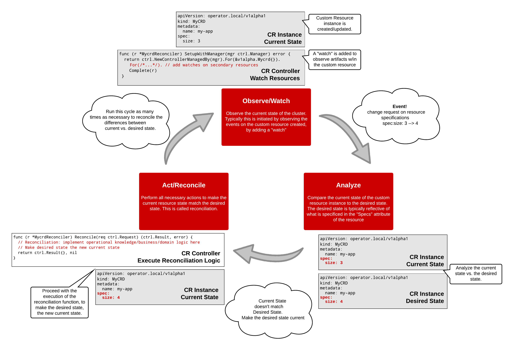

# Golang Operators

## Prereqisites

- Review the [introduction](../01/01-introduction.md), if you have not already
- Familiarity with Golang. If you are not familiar with Go, atleast go through this resource: https://tour.golang.org/welcome/1

## Agenda

This section will cover the following: 

- Review options for working with Operators in Golang
- Useful Golang API References for working with CRDs, Controllers, and the [Controller Runtime](https://github.com/kubernetes-sigs/controller-runtime)
- Review the [Reconciliation Cycle](../01/01-introduction.md#how-do-operators-work) with Golang semantics

Afterwards, you will take the plunge in a guided walkthrough. 

# Golang Operator Resources

## Development Libraries

Two resources you can check out for writing Operators in Golang: 

- [Operator Framework](https://operatorframework.io/)
- [Kubebuilder](https://book.kubebuilder.io/quick-start.html)

In this documentation, you will be leveraging the Operator Framework. 

In case you are curious of some of the differences between the two, here's a recap: [What is the difference between kubebuilder and operator-sdk?](https://github.com/operator-framework/operator-sdk/issues/1758#issuecomment-517432349)

# Useful Golang API References

While developing Golang Operators, much of what is written, can leverage common libraries for Kubernetes API development, as shown below. The resources below are ideal for using as reference. Many of them come with inline examples of how to use them in code. This is just small subset of what's actually available out here in the community. 

- https://pkg.go.dev/k8s.io/apimachinery?tab=overview
  - Scheme, typing, encoding, decoding, and conversion packages for Kubernetes and Kubernetes-like API objects.

- https://pkg.go.dev/github.com/kubernetes-sigs/controller-runtime?tab=doc
  - Package controllerruntime alias' common functions and types to improve discoverability and reduce the number of imports for simple Controllers.

- https://pkg.go.dev/sigs.k8s.io/controller-runtime?tab=doc
  - Package controllerruntime provides tools to construct Kubernetes-style controllers that manipulate both Kubernetes CRDs and aggregated/built-in Kubernetes APIs. It defines easy helpers for the common use cases when building CRDs, built on top of customizable layers of abstraction. Common cases should be easy, and uncommon cases should be possible. In general, controller-runtime tries to guide users towards Kubernetes controller best-practices.

- https://pkg.go.dev/k8s.io/api?tab=overview
  - Schema of the external API types that are served by the Kubernetes API server.
  - Most notably, you will be able to find the types for constructing resources such as (to name a few):
    - Pods
    - Services
    - Deployments
    - Replicasets
    - Daemonsets

# The Reconciliation Cycle - Revisited

Let's recap the Reconciliation Cycle in a bit more detail. 

## Observe/Watch

In this phase, the controller observes the state of th cluster. Typically this is initiated by observing the events on the custom resource instance. These events are usually subscribed from the custom resource controller. Consider this to be similar in ways to a pub/sub mechanism between the resource controller and cluster. 

TODO: add more

## Analyze

In this phase, the resource controller compares the current state of the resource instance to the desired state. The desired state is typically reflective of what is specified in the `spec` attributes of the resource. 

TODO: add more

## Act/Reconcile

In this phase, the resource controller performs all necessary actions to make the current resource state match the desired state. This is called reconciliation, and is typically where operational knowledge is implemented (i.e. business/domain logic).

TODO: add more