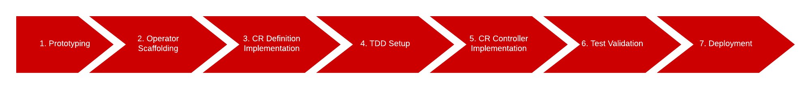

# A Golang Operator - Over Easy

## Overview

This is a guided lab. In comparison to some of the other operator labs that you will find in this guide, you will notice that this lab is heavier in annotations and explanations.

Please do not rush through this lab. You should leverage this lab to **learn**, get things to work, experiment and "break" stuff. It's okay to do that here in this context. 

That being said, these labs are meant to be run in a sandboxed development environment. Do not run this lab in a critical and/or production environment. 

## How to use this Lab 

You can do either of the following in this lab: 

1. Read through the lab in it's entirety and follow all of the directions, step by step. Going down this route, you will be given a crash course in Behavioral Driven Design (BDD), Test Driven Design (TDD), and how to apply them towards building a Golang based Operator. If this interests you, then proceed to the next section below. 

    - __*OR*__

2. View the implementation of the lab code in it's entirety, study it, run it, and/or do with it what you will. If that is the case, the lab code can be found in the following location: `docs/02/labs/000/code`

There's no wrong way to learn. 

## Environment Setup

Ensure lab pre-requisites have been met. See: [Lab Requirements](../01/03-lab-requirements.md)

## Lab Specifications

### Story (BDD/Gherkin Style)

**TITLE**: Overeasy Operator Requirements

- **DESCRIPTION**
    - **AS A**: Developer
    - **I WANT**: An Operator with a single busybox pod that logs a user specified message and shuts down after a user specified amount of time. If a duration or message are not specified, then both will be supplied by a REST API call. 
    - **SO THAT**: I can demonstrate the encapsulation of operational knowlege, leveraging the Operator Design Pattern.  

- **SCENARIO 1**: Shutdown the busybox pod after a user specified amount of time in seconds
  - **GIVEN**: An Operator instance
  - **WHEN**: the specification `timeout` is set to a numeric value in seconds
  - **THEN**: the busy box pod will remain available for the specified `timeout` duration in seconds,

- **SCENARIO 2**: Log a user specified message before shutting down the busybox pod
  - **GIVEN**: An Operator instance
  - **WHEN**: the specification `message` is set to a string value
  - **THEN**: the busy box pod will log the message, from the `message` specification after the `timeout` duration has expired. 

- **SCENARIO 3**: Retrieve the `timeout` and `message` from a given REST API if one and/or the other is not supplied. 
  - **GIVEN**: An Operator instance
  - **WHEN**: the specification `message` OR `timeout` is NOT set
  - **THEN**: the busy box pod will supply these values from the following REST API: `GET http://my-json-server.typicode.com/keunlee/test-rest-repo/golang-lab00-response`

- **SCENARIO 4**: Update status `expired` and `logged` when the busybox pod has expired
  - **GIVEN**: An Operator instance
  - **WHEN**: the busy box pod's duration has expired
  - **AND**: the busy box pod has logged a message
  - **THEN**: set the operators `expired` status to `true`
  - **AND**: set the operators `logged` status to `true`

### Acceptance Criteria Notes

- The CRD must have a `timeout` specification attribute
- The Operator instance must shut down after the duration of `timeout` in seconds, has been reached
- The CRD must have a `message` specification attribute
- The Operator instance must log the message `message` before the container has stopped
- The CRD must have a `expired` status attribute
- The Operator must set the status of the busy box pod upon expiration, `expired`
- The CRD must have a `logged` status attribute
- The Operator must set the status of the busy box pod when logging a message, `logged`
- The Operator instance must retrieve a `message` and `timeout` value from a REST API call (`GET http://my-json-server.typicode.com/keunlee/test-rest-repo/golang-lab00-response`), if both are not initially supplied on the Operator Instance. 

## Execution Strategy

In a nutshell, we want our operator to start up a pod, running a busybox image for a specific duration and logging a user specific message, and then setting our Operator's status. 

We'll want our Operator to provision our busybox pod with the necessary attribute specifications, eventually. 

Our strategy to reach the end state is detailed as followed: 



- **I - Prototyping** - Create a YAML specification for a pod which runs for a specified amount of time and logs a specific message. Do this to validate our design. We'll eventually want our Operator controller implementation to dynamically set the pods timeout duration and log message. For now, we will validate our prototype. 

- **II - Operator Scaffolding** - Scaffold a Golang Operator to give us an initial template for our CRD and Resource Controller

- **III - CR Definition Implementation** - Add properties for your Custom Resources Specifications and Status attributes. 

- **IV - TDD Setup** - Create a Unit Test file for our Custom Resource Controller to validate our requirements leveraging TDD (Test Driven Design). We will validate the tests as we implement our controller. 

- **V - CR Controller Implementation**- Implement our Resource Controller logic to help fulfill the Story and Acceptance Criteria.

- **VI - Test Validation** - Validate our Unit Tests. Sanity check our Operator so that it is indeed operating as intended. 

- **VII - Deployment** - Deploy the Operator to your Kubernetes cluster

> :information_source: CR is an acronym for "Custom Resource"

### I. Prototyping

(0) Create a Workspace

> <ins>:warning: Do This</ins>

Before you begin, make sure to set a directory that you'd like to work from. This directory will contain all of your lab code. 

(1) Build a Proof of Concept

> <ins>:warning: Do This</ins>

Let's begin by creating a project namespace in our cluster. 

```bash
kubectl create ns golang-op-lab-00
```

set the current context to newly created namespace

```bash
kubens golang-op-lab-00
```

Create the yaml for a pod which will start a busybox container and run for a specified duration, 15 seconds, and logs the message "hello world".

```bash
# create the pod yaml
kubectl run busybox --image=busybox --restart=Never --dry-run -o yaml -- /bin/sh -c 'sleep 15; echo "hello world"' > golang-op-lab-00-pod.yaml
```

Running the following will yield the following generated yaml contents: 

```yaml
apiVersion: v1
kind: Pod
metadata:
  creationTimestamp: null
  labels:
    run: busybox
  name: busybox
spec:
  containers:
  - args:
    - /bin/sh
    - -c
    - sleep 15; echo "hello world"
    image: busybox
    name: busybox
    resources: {}
  dnsPolicy: ClusterFirst
  restartPolicy: Never
status: {}
```

To deploy the pod, watch it's change in status after the set duration, and view the pods logs:  

```bash
# deploy the pod
kubectl apply -f golang-op-lab-00-pod.yaml

# watch for changes on the pod, ctrl-c to exit the watch
watch kubectl get po

# display log messages
kubectl logs busybox -c busybox
```

(2) Identify Domain Specific Operations

At this point, we've got a basic prototype of what we'd like the final deployment state of our Operator in tried to
The next step from here, is thinking about what our **domain specific operations** are. The previously generated pod YAML will not handle all of these operations as is. Rehashing requirements into domain specific operations: 

- **If a message and duration are supplied, create a busybox pod with a duration and message** : This is pretty straightforward to automate. You just specify the `timeout` duration and `message` in the pods YAML. No real issues here. 

- **If a message and duration are NOT supplied, then supply one from a REST API call, and then create a busybox pod with the duration and message**:  Since we've got a dynamic element at play here, we can automate this in code, w/in our CR Controller. 

We now have a purpose for building an operator, which will automate our domain specification operations. 

### II. Operator Scaffolding

To begin codifying our domain specific operations, run the following to scaffold your operator and create a resource and controller. Say 'yes' to all prompts. 

> <ins>:warning: Do This</ins>

```bash
# scaffold a new operator - over-ez-operator
operator-sdk init --domain=mydomain.com --repo=github.com/mydomain/operators-over-ez

# create new api and controller
 operator-sdk create api --group=operators-over-ez --version=v1alpha1 --kind=OpsOverEasy

# (you will be prompted the following) - create resource [y/n] y

# (you will be prompted the following) - create controller [y/n] y
```

One you run the above, you'll see a number of files generated. Of those files, the CR Implementation and controller: 

- CR Implementation location: `api/v1alpha1/opsovereasy_types.go`

- CR Controller location: `controllers/opsovereasy_controller.go`

These resources will be particularly important going forward. 

### III. CR Definition Implementation

(1) Add specification and status attributes, per requirements. 

In this step, you will define your operator specifications and status attributes. 

> :paperclip: For reference, the full CR Definition Implementation can be found here: https://bit.ly/32jOlSU

**Operator Specifications**:

These are user defined properties of your operator. When you add a specification, you typically implement your operator to respond/react off of the specification that is set. 

<ins>Example 1</ins>

*We set the specifications `timeout` and `message` to finite/non-null values in our operator instance yaml. When we create the operator instance, our operator is expected to then deploy a busybox pod, which will run the busybox container for the `timeout` duration and log the `message`.* 

<ins>Example 2</ins>

*We leave the specifications for `timeout` and `message` unset in our operator instance yaml. When we create the operator instance, our operator is expected to then obtain values for `timeout` and `message` from a REST API call and then deploy a busybox pod, which will run the busybox container for the `timeout` duration and log the `message`.* 

> <ins>:warning: Do This</ins>

Edit the file `api/v1alpha1/opsovereasy_types.go` by adding the `timeout` and `message` specifications w/in the `OpsOverEasySpec struct` definition. It should look like the following: 

```golang
// OpsOverEasySpec defines the desired state of Mycrd
type OpsOverEasySpec struct {
	// INSERT ADDITIONAL SPEC FIELDS - desired state of cluster
	// Important: Run "make" to regenerate code after modifying this file

	// Accommodate requirements and acceptance criteria

	// Timeout duration, in seconds
	Timeout int32 `json:"timeout,omitempty"`

	// Log message to output before container expires
	Message string `json:"message,omitempty"`
}
```

Our **CR Controller**, must implement the logic, workflow and functionality to facilitate these examples, which are based on our requirements. 

**Operator Statuses**:

These are user defined properties for checking the status/state of your operator deployment. When you add a status, you typically implement your operator to provide the state/value of the status. 

<ins>Example</ins>

*When we deploy our operator, we expect a busybox pod to be spun up, log message, and then spin down after set duration. When the pod has reached this state, then the operator will need to set it's status for `expired` and `logged` to `true`.* 

> <ins>:warning: Do This</ins>

Edit the file `api/v1alpha1/opsovereasy_types.go` by adding the `expired` and `logged` statuses w/in the `OpsOverEasyStatus struct` definition. It should look like the following: 

```golang
// MycrdStatus defines the observed state of Mycrd
type OpsOverEasyStatus struct {
	// INSERT ADDITIONAL STATUS FIELD - define observed state of cluster
	// Important: Run "make" to regenerate code after modifying this file

	// Denotes if the time duration has expired
	TimeoutExpired bool `json:"expired,omitempty"`

	// Denotes if a message was logged
	MessageLogged bool `json:"logged,omitempty"`
}
```

(2) Regenerate/update resource and manifest

> <ins>:warning: Do This</ins>

Always do this after you update your custom resource in `*_types.go`

```bash
# generate/update code for resource types
make generate

# generate/update manifests for the CRD
make manifests
```

You can validate specification updates on your CRD by examining the updated file: `config/crd/bases/operators-over-ez.mydomain.com_opsovereasies.yaml`. You should see that your newly added specifications, `timeout` and `message`, have been added. 

### IV. TDD Setup

For this lab we will be taking a TDD (Test Driven Design) approach to building and implementing our operator. 

**(1)** Update the Test Suite

> <ins>:warning: Do This</ins>

When we generated our custom resource definition and controller, we also generated a stub for a test suite.  

> :paperclip: For reference, the full Test Suite Implementation can be found here:  https://bit.ly/2Qi9ZRQ

Copy the contents of the file to your local Test Suite file: `controllers\suite_test.go`

**(2)** Observation of updates

In these following sections, we will make observations on the additions added to the Test Suite file. 

- **(a)** Added additional package imports that we will be leveraging 
  - 

- **(b)** Added additional variables and helper functions that we'd like to make available to our controller tests. 
  - Public variables and functions are accessible in the test suite by our controller test. Leveraging this feature, we can reuse these methods, potentially, across multiple controller test files. 
  - Variables:
    - *k8sManager*: Instance of our Kubernetes API Manager.
	- *opsOverEasyReconciler*: Instance of our Controller.
	- *crdInstance*: Instance of our Custom Resource.
	- *testCtx*: Intance of our testing context. 
	- *timeout*: Timeout duration for asynch tests. Used primarily for evaluating Ginkgo/Gomega `Eventually` async assertions. 
	- *interval*: Interval to evaluate async assertions.
	- *podDuration*: Duration for which our busybox pods will run for
  - Functions: 
    - *getCrKey*: Helper method for building a key for the Custom Resource.
    - *getPodKey*: Helper method for building a key for a Pod Resource.
    - *getCrd*: Helper method for building a Custom Resource Definition instance with or without specification attributes provided. 
  - 

- **(c)** Bootstrap our test enviornment to a real cluster. 
  - Since we'll need to validate the internals of our deployment (i.e. such as pod phase, etc.), we'll want to run these tests against a live cluster. To automate a test cluster, one suggestion would be to automate the provisioning of a cluster, leveraging a lightweight cluster implementation such as  [Kind](https://kind.sigs.k8s.io/docs/user/quick-start/) or [K3S/K3D](https://k3d.io/) 
  - 

- **(d)** Setup our Custom Resource Controller. 
  - Create an instance of our controller reconciler that we'll be using in our controller tests
  - Add the appropriate "watches" on the resources that the Custom Resource owns. 
  - The call to `(opsOverEasyReconciler).SetupWithManager(k8sManager)` is responsible for add "watches" on resources owned by your Custom Resource. You will later implement this method in your controller. 
  - 

- **(e)** Automate the uninstall of a CRD after it has been tested on our cluster. 
  - 

**(3)** Add Controller Tests and define Test Stubs

For our tests, we are leveraging the Golang Testing Libraires [Ginkgo](https://onsi.github.io/ginkgo/) and [Gomega](https://onsi.github.io/gomega/). More information can be found by clicking on the links. 

> <ins>:warning: Do This</ins>

> :paperclip: For reference, the **fully** implemented Controller Test file can be found here:  https://bit.ly/2YxaAnb.

Create the following file: `controllers/opsovereasy_controller_test.go`

And copy the contents of the **"fully"** implemented Controller Test into it. 

Notice how each test corresponds to a BDD scenario, as noted in the comments of each test. 

As we implement our Custom Resource Controller, we will leverage these tests to validate our scenario requirements and controller implementation.

You can run them by executing the following at the root of the source directory: 

```bash
make test
```

This will run the entire Test Suite. 

When you run this, all tests will fail at this point. This is as expected, since we have not yet implemented our Resource Controller. 

Let's go ahead and look at the Controller Test file and examine it in further details. 

- **(a)**: Added variables and helper functions that we'd like to make available to our controller tests.
  - Variables: 
    - *pod*: The pod instance we'll be using to track our busybox pod deployment.
    - *currUuid*: A naming helper that we use to assist in allowing us to create unique Custom Resource and Pod instance names. 
  - Functions: 
    - *createReconcileRequest*: Invokes the `Reconcile` method of our controller, thereby changing the state of our Operator. 
    - *getPodLogs*: Retrieves the "logs" of a pod leveraging Kubernetes API calls and returns them as a string.   
  - 

- **(b)**: For each test, we must ensure that a new Operator instance is created for the current running test. These additions will create a new Custom Resource instance and Custom Resource Controller instance for each test that is ran.  
  - On running of the `BeforeEach` method, a new Operator instance will be created.
  - On running of the `AfterEach` method, the last Operator instance, is deleted. When deleted, any resources created and "watched" by the Operator instance (i.e. pods, etc.) are also deleted. 
  - 

- **(c)**: The entire Custom Resource Controller test file has been structured and implemented in a way to follow the Gherkin as noted in the requirements. Please see the full implementation of the Custom Resource Controller Test if you have not done so. 
  - By being able to create your tests up front like this, before the Controller implementation, you force the design and implementation of your controller. Your tests will dictate the controllers implementation. This is a hallmark of Test Driven Design (TDD).

### V. CR Controller Implementation

> <ins>:warning: Do This</ins>

> :paperclip: For reference, a **fully** implemented Custom Resource Controller can be found here: https://bit.ly/34CEtqa.

Copy the contents of the file to your local Custom Resource Controller: `controllers\opsovereasy_controller.go`

Let us now examine the Resource Controller implementation from the context of the Reconciliation Cycle. 


#### I. Observe/Watch Phase

For our Operator, we are deploying a busybox pod through our Operator deployment. 

In order for our Operator to keep an eye on this pod, we need to watch for changes that happen upon it. 

> <ins>:book: Analyze This</ins>

To do that we specify the resource type(s) that our Operator will be deploying and looking at by leveraging the Controller Runtime API call to `Owns`. 


In this context, `Owns` defines types of Objects being *generated* by the `NewControllerManagedBy`, and configures the `NewControllerManagedBy` to respond to create / delete / update events by *reconciling the owner object*, which in this case `&corev1.Pod{}`. 

In other words, if there's a resource type that your operator is deploying, and you'd like to keep tabs on it, then use `Owns` to keep tabs on the resource type that you want to keep tabs on. 

Should you have more types of resources that you want to deploy and keep tabs on, you can do so by chaining the `Owns` API (i.e. `...Owns(&corev1.Pod{}).Owns(&corev1.PersistentVolume{}.Owns(/****/).Complete(r)` )

You can get more information about available resource types (i.e. pods, services, pv, pvc, etc.) here: 

- https://pkg.go.dev/k8s.io/api@v0.19.0/core/v1?tab=doc
- https://github.com/kubernetes/api/blob/v0.19.0/core/v1/types.go

#### II. Analyze Phase

Since we are starting off with a new Operator instance, the desired state for our operator will be a new instance. 

An instance definition of that operator with respect to our Custom Resource Definition might look like this. 

```yaml
apiVersion: operators-over-ez.mydomain.com/v1alpha1
kind: OpsOverEasy
metadata:
  name: opsovereasy-sample
spec:
  # specification attributes as defined in the CRD
  timeout: 15
  message: "hello world"
```

Which will yield a busybox pod for 15 seconds and then log the message "hello world" before the pod stops as well as updating the operator's status fields. Ultimately the final state of our operator instance's resources would report `0/1` pods running and would look like this if we queried the operator instance (notice the added status attributes): 

```yaml
# at terminal: kubectl get opsovereasies your-operator-instance -o yaml

apiVersion: operators-over-ez.mydomain.com/v1alpha1
kind: OpsOverEasy
metadata:
  name: opsovereasy-sample
spec:
  # specification attributes as defined in the CRD
  timeout: 15
  message: "hello world"
status: 
   # status attributes as defined in the CRD
   # NOTE: these are added/updated after the `timeout` duration and log `message`
  expired: true
  logged: true
```

By design, our operator will add/update the status attributes after the `timeout` duration has been reached and a `message` has been logged. 

#### III. Act/Reconcile Phase

**Setting Operator Permissions on Resources**

To ensure that we are able to reconcile all of the resources that we are watching we need to make sure that we are authorized to do so. Specifically, we need to specify the types of resources that we watch. 

> <ins>:book: Analyze This</ins>

We can do that by adding a few extra directives in the form of comments, right above our `Reconcile` function. 


The first line translates: 

 - *for all resource `deployments` in the `apps` groups, allow the following actions by our operator*
   - *get*
   - *list*
   - *watch*
   - *create*
   - *update*
   - *patch*
   - *delete*

The second line similarly translates: 

 - *for all resource `pods` in the `apps` groups, allow the following actions by our operator*
   - *get*
   - *list*
   - *watch*
   - *create*
   - *update*
   - *patch*
   - *delete*

> <ins>:warning: Do This</ins>

After adding the following we need to run the following at the terminal to update our RBAC policies for our Operator: 

```bash
# generate/update code for resource types
make generate

# generate/update manifests for the CRD
make manifests
```
**Reconcile Function Implementation - Breakdown**

Let us now dissect our `Reconcile` function. 

<!-- - Creating/Updating resources such as our busybox `pod`
- Facilitating Domain Specific Operations. In our case, 
  - Setting `message` and `timeout` spec attributes with the response of a REST API response
  - Setting `logged` and `expired` status attributes when our pod has successfully run it's duration.
  - Requeuing and terminating the Reconciliation cycle -->

**(a)**: Here we make an attempt to retrieve an instance of our Custom Resource. That is done by the call to `r.Client.Get`. When this method executes and all goes well it will populate the `instance` of `OpsOverEasy{}`. Otherwise, the `err` object is populated. We validate this with the `err` check. 


**(b)**: Here we fullfill the requirement of obtaining values for specification attributes `message` and `timeout` from a REST API response. This code is executed only, if the specification attributes are not provided. We make our call to retrieve the API response, and assign new values to `message` and `timeout`. Once assigned, we make sure to update the operator instance by the call to `r.Client.Update`. 


**(c)**: Here we make a resource definition for a busybox `pod`. With this definition we'll be able to query if the `pod` has already been created in a previous `Reconcile` or if the `pod` needs to be recreated. We make the pod resource definition through a custom function `newPodForCR`. 


If we look at the implementaiton of the `newPodForCR` function, we see some familiar looking code that isn't quite yaml: 


This is equivalent to the following yaml: 

```yaml
apiVersion: v1
kind: Pod
metadata:
  creationTimestamp: null
  labels:
    app: {{cr.Name}}
  name: {{cr.Name}}-pod
  namespace: {{cr.Namespace}}
spec:
  containers:
  - args:
    - /bin/sh
    - -c
    - sleep {{timeout}}; echo {{message}}
    image: busybox
    name: busybox
    resources: {}
  dnsPolicy: ClusterFirst
  restartPolicy: Never
status: {}

```
**(d)**: In this block, we attempt to apply our pod definition if one doesn't exist. This is the eqivalent of taking the above pod `yaml` definition and running `kubectl apply -f` on it. The code equivalent of this statement is seen in the call to `r.Client.Create`.


**(e)**: In this block, we update the status of the Operator based on the busybox `pods` current state. We set the status of the `pod` after it has run it's course and reaches a status of `PodSucceeded`. Once an updated status has been assigned, we must then update the status by a call to `r.Client.Status().Update`. 

This block will likely not execute in the first call to `Reconcile` since the pod must be created first and then live out it's duration, specified by `timeout`. It will only execute in subsequent calls/triggers to `Reconcile`. 


**(f)**: At this point, our operator has reached it's desired state. The reconciliation cycle will not execute until another change in state on the operator is requested. 


**A Note on Reconcile Return Values**

Notice that different variations of: `return ctrl.Result` that you see in the Reconcile function. 

The Reconcile function can be ordered retrigger (or requeue) based on variations of the return value. 

There's meaning to these variations. They are as followed: 

- Reconcile is successful and do NOT requeue for re-trigger
  - `return ctrl.Result{}, nil`
- Reconcile has failed from error and requeue for re-trigger
  - `return ctrl.Result{}, err`
- Requeue the Reconcile for re-trigger
  - `return ctrl.Result{Reqeue: true}, nil`
- Requeue the Reconcile for re-trigger after a set amount of time
  - `return ctrl.Result{RequeueAfter: time.Second*10}, nil`

**Additional Observations**

Variables and helper functions: 

  - Variables/Structs:
    - *ApiSampleResponse*: The response object type that we leverage when unmarshalling the sample REST API response
  - Functions: 
    - *newPodForCR*: This function creates a busybox pod definition
    - *getSampleRestAPIResponse*: This function makes a REST API request and returns the response as an `ApiSampleResponse` type.


### VI. Test Validation

#### I. Running Tests

To run tests on your operator, run the following: 

```bash
make test
```

#### II. Run and Validate Your Operator Locally

To run the operator locally without deploying it to your cluster, from the root of the code directory (`docs/02/labs/000/code`). 

**(a)**

Run the following ( we will call this terminal #1): 

```bash
# install the Operator CRD
make install

# run the operator locally
make run ENABLE_WEBHOOKS=false
```

**(b)**

In a separate terminal (terminal #2): 

```bash
# create an operator instance
kubectl apply -f config/samples/operators-over-ez_v1alpha1_opsovereasy.yaml

# describe the operator instance you've created
# depending on the state of the operator and it's deployment, you may want
# to run this multiple times to observe the operator's state changes
# or execute it in a `watch` statement to observe the operator's state changes
# watch describe opsovereasies opsovereasy-sample 
kubectl describe opsovereasies opsovereasy-sample
```

**(c)**

`ctrl-c` in terminal #1 to stop the operator from running. Run the following to remove the operator from your cluster: 

```bash
# uninstall the operator and it's associated deployments. 
make uninstall
```

### VII. Deployment

TODO

[Return to Table of Contents](../../../../)


